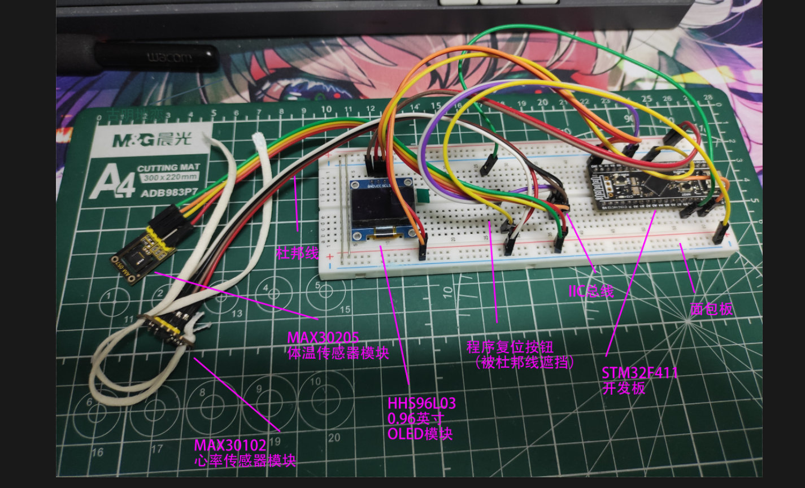
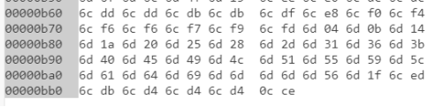
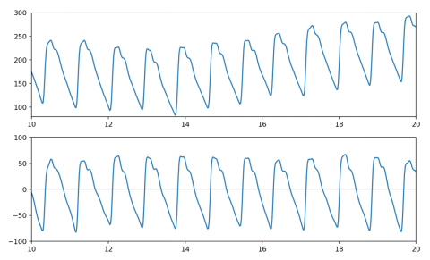

# HR_BodyTemperature_MCU
A simple heart rate and temperature monitoring device based on micropython.

一个简易的基于MicroPython的心率体温监测装置。

## 项目（？）简介
本项目是本人本科毕设的代码部分。本人毕设主要是制作一个基于单片机的可用于检测体温与心率的设备。

其中，本项目主要使用的设备如下

|设备|作用|
|---|---|
|STM32F411CEU6|单片机|
|MAX30102|心率检测装置|
|MAX30205|体温监测装置|
|HS96L03|0.96英寸OLED显示屏|

其中，所有设备均建议使用已经集成好必要元器件的**模块**或**开发板**使用。+



其中STM32所使用的MicroPython固件为微行科技的[STM32F4x1 MiniF4](https://github.com/WeActStudio/WeActStudio.MiniSTM32F4x1)

## 大致引脚定义
|单片机接口|接至|
|---|---|
|PB10、PB3|OLED屏的IIC口|
|PB6、PB7|MAX30102与MAX30205的IIC口|
|PB0|自定义复位口|

## 大致实现原理
单片机读取心率传感器中的光强度反射数据（等价于脉搏波信息），主要通过极值算法计算出一段时间内的心跳次数，从而计算出每分钟的心跳数。体温则通过读取体温传感器中的数据计算得出。

## 包内程序大致讲解
```codes```文件夹内的文件即为该设备的所有程序。

```codes/max30102```文件夹内为MAX30102的驱动程序，该文件为本人在[STM32F4x1 MiniF4](https://github.com/kandizzy/esp32-micropython/blob/master/PPG/ppg/MAX30105.py)的基础上进行精简而成

```codes/ssd1306py```文件夹内为0.96英寸OLED显示屏的驱动程序，该程序为本人在[jdh99](https://blog.csdn.net/jdh99)的驱动程序上魔改而成

```codes/some_other.py```文件为本人自己写的一些驱动程序

```codes/main.py```文件为主程序，设备运行的主要逻辑与一些心率处理算法写在该文件内

```codes/red.bin```文件为以二进制格式保存下来的最后一次运行的数据。由程序自动生成与更新，其中数据为四位十六进制数所存储的数据，前1500组数据为心率的原始数据（反射光强度的信息），最后一组数据为体温信息，其中体温数据为100倍摄氏度（即小数点后移两位）



该文件内的数据可处理为脉搏波图像，如下：



## 结果展示
在正确配置与使用的情况下，其输出结果如下图：


***
